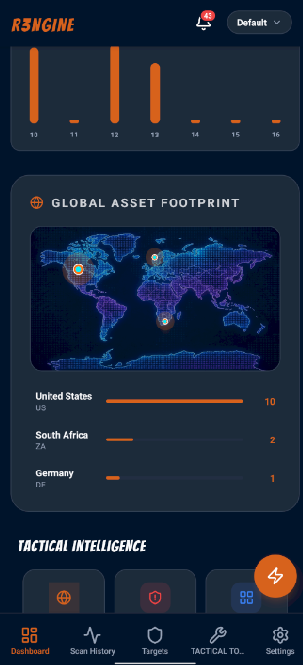
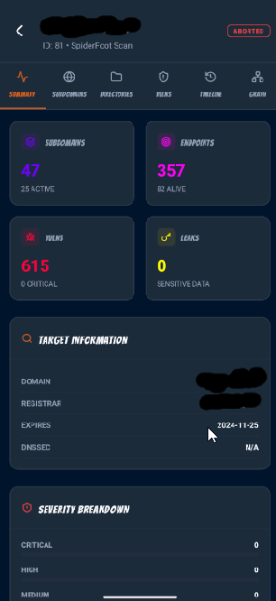
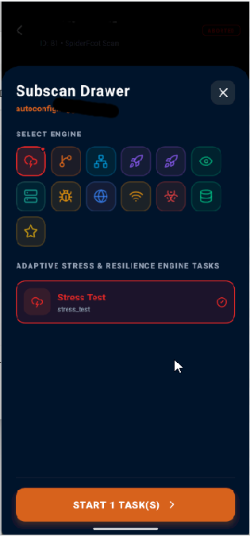

<p align="center">
<a href="https://rengine.wiki"></a>
</p>

<p align="center">
  <h4 align="center"><strong>Phoenix: Fire from the Ashes even Stronger</strong></h4> 
  <h3 align="center">Official v3 Mobile Companion: The Tactical Reconnaissance Interface in Your Pocket 🚀</h3>
</p>

<p align="center">
<a href="https://github.com/whiterabb17/r3ngine-mobile/releases" target="_blank"></a>&nbsp;<a href="https://github.com/whiterabb17/r3ngine/releases" target="_blank"></a><br/><a href="https://www.gnu.org/licenses/gpl-3.0" target="_blank"></a>&nbsp;<a href="https://expo.dev" target="_blank"></a>
</p>

<h4>r3ngine Mobile: Tactical Reconnaissance 3.0</h4>
<p>
  r3ngine Mobile is the official cross-platform companion app for the <b>r3ngine 3.0 Phoenix Rebirth</b>. Designed for security professionals who need to maintain tactical awareness while away from their terminal, the mobile app provides a high-fidelity, glassmorphic interface to your reconnaissance data.
</p>


## ⚡ The Tactical Advantage: Core Features

The mobile app isn't just a viewer; it's a portable command center synchronized with your r3ngine core.

### 🧠 Real-Time Intelligence Dashboard
*   **KPI Command Center**: Monitor Targets, Subdomains, Endpoints, and Vulnerabilities at a glance.
*   **Severity Distribution**: Instant visualization of your threat landscape (Critical, High, Medium, Low).
*   **7-Day Activity Horizon**: Chronological tracking of vulnerability discovery trends.
*   **Geo-Tactical Asset Mapping**: Interactive global positioning of assets with high-performance CSS-animated markers.

### 🕵️ Surgical Asset Management
*   **Subdomain Inventory**: Browse, search, and filter discovered subdomains on the go.
*   **Target Profiles**: Deep dive into target-specific data, technologies, and vulnerabilities.
*   **Vulnerability Feed**: Real-time biohazard-themed feed of newly discovered threats with severity indicators.

### 🌪️ Scan Orchestration & Control
*   **Live Progress Tracking**: Monitor scan pipeline health and completion status in real-time.
*   **Remote Execution**: Initiate quick scans or stop active processes directly from your phone via the unified **StopScan API**.
*   **Scan History**: Review historical scan results and summaries with full data persistence.

### 🥷 Stealth & Security
*   **Secure Credential Storage**: Native integration with **Expo SecureStore** for API keys and authentication tokens.
*   **PII Gate Compliance**: All mobile communication respects the core's PII gate, ensuring reconnaissance data remains private.
*   **Authentication Resilience**: Hardened login flow with session persistence and automatic redirection.

### 🎨 Premium Visual Experience
*   **Cyberpunk "Neon" Theme**: Glassmorphic UI matching the core v3 identity, optimized for dark mode and high-contrast environments.
*   **Bangers Typography**: Tactical header styling using the signature Bangers font.
*   **Lucide-React-Native Icons**: Clean, modern iconography for fast visual recognition.


## 📸 Visual Interface

<!-- 
<p align="center">
  
</p>
-->

| Dashboard | Geo-Tactical Map | Scan Details | Scan Orchestration |
| :---: | :---: | :---: | :---: |
|  |  |  |  |


## 🛠️ Technology Stack

Built with a "Safety-First" philosophy, the mobile app leverages a modern, high-performance stack:

*   **Framework**: [Expo](https://expo.dev/) (React Native)
*   **Routing**: [Expo Router](https://docs.expo.dev/router/introduction/) (File-based navigation)
*   **Data Fetching**: [TanStack Query v5](https://tanstack.com/query/latest) (Asynchronous state management)
*   **State Management**: [Zustand](https://github.com/pmndrs/zustand) (Lightweight global state)
*   **Networking**: [Axios](https://axios-http.com/) with centralized interceptors
*   **Animations**: [React Native Reanimated](https://docs.swmansion.com/react-native-reanimated/)
*   **Icons**: [Lucide-React-Native](https://lucide.dev/) & [FontAwesome](https://fontawesome.com/)


## 🚀 Quick Installation (Development)

### Prerequisites
*   Node.js (LTS)
*   Expo Go app on your [iOS](https://apps.apple.com/app/expo-go/id982107779) or [Android](https://play.google.com/store/apps/details?id=host.exp.exponent) device.

### Setup
1.  **Clone and Navigate**
    ```bash
    git clone https://github.com/whiterabb17/r3ngine-mobile.git
    cd r3ngine-mobile
    ```

2.  **Install Dependencies**
    ```bash
    npm install
    ```

3.  **Start Development Server**
    ```bash
    npx expo start
    ```

4.  **Connect to Backend**
    *   Open the app on your device.
    *   Enter your **r3ngine Core IP/Domain**.
    *   Log in with your standard r3ngine credentials.


## 🧭 Workflow Integration

r3ngine Mobile acts as a thin client to the **r3ngine Core API**. It utilizes the same OpenAPI contract as the web frontend, ensuring that every finding discovered by **APME**, **ASRE**, or **Nuclei** is instantly reflected in your hand.

*   **API Client**: Centralized configuration in `src/api/client.ts`.
*   **Types**: Strictly mapped to `openapi.json` for full type safety.
*   **Diagnostics**: Built-in connection testing to verify reachability of your r3ngine instance.


## 🛡️ License

Distributed under the **GNU GPL v3 License**. See the main [LICENSE](../LICENSE) for more information.


<p align="right"><i>Note: This mobile app is a companion to the r3ngine core and requires a running r3ngine instance to function.</i></p>
